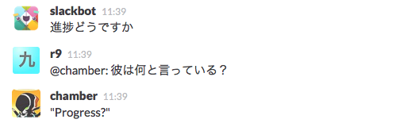

Chamber
=======

Chamber is a tool that translates [Slack](https://slack.com/) messages using [The Microsoft Translator API](http://www.microsoft.com/en-us/translator/developers.aspx).
Currently, Chamber supports translating from English to Japanese and from Japanese to English.
The name of Chamber is taken from the character by the Japanese animation [翠星のガルガンティア](http://gargantia.jp/) (Gargantia on the Verdurous Planet).

## Requirements

- Configure Slack
  - Create an outgoing web hook by selecting "Outgoing WebHooks" from the "[Add New Integrations](https://my.slack.com/services/new)" option on the Slack Integrations page.
    - Set on the "Channel".
    - Not set on "Trigger Word(s)", **it's important**.
    - Set a server url (like "https://chamber.example.com") on the "URL(s)". If you have a valid certification for SSL, you should use it. **But self signed certification does not work.**
  - Create an incoming web hook by selecting "Incoming WebHooks" from the "[Add New Integrations](https://my.slack.com/services/new)" option on the Slack Integrations page.
    - Set on the "Channel".
      - It is recommened that you set the channel that is the same as "Outgoing Webhooks", because this tool seems true to bot.
    - After creating the web hook, you can confirm the token of the integration.

- Configure a Windows Azure Marketplace account
  - If you don't have it, you can create the account in https://datamarket.azure.com/ .
  - Create an application with Microsoft Translate API.
    - After creating the application, you can confirm the client secret of the application.

## Run Chamber

You must set environments below keys.

* SLACK_TEAM
* SLACK_ACCESS_TOKEN
* SLACK_CHANNEL
* SLACK_USERNAME
* AZURE_CLIENT_ID
* AZURE_CLIENT_SECRET

If you want to run on Heroku, you must set environments like below.

<pre>
$ heroku config:set SLACK_TEAM="your_slack_domain"
$ heroku config:set SLACK_ACCESS_TOKEN="incoming_webhooks_token"
$ heroku config:set SLACK_CHANNEL="#incoming_webhooks_channel"
$ heroku config:set SLACK_USERNAME="incoming_webhooks_username"
$ heroku config:set AZURE_CLIENT_ID="azure_client_id"
$ heroku config:set AZURE_CLIENT_SECRET="azure_client_secret"
</pre>

Run chamber.

<pre>
$ bundle install
$ bundle exec thin start
</pre>

Of course, you can use the server supported Rack like Unicorn.

## Translate

If you don't understand the latest message in Slack, let's ask Chamber!

### English -> Japanese

<pre>
Bob> A rolling stone gathers no moss.
r9> @chamber: 彼は何と言っている？
chamber> 「転がる石は苔むさない。」と言っている。
</pre>

### Japanese -> English

<pre>
r9> 終わりよければすべてよし。
Bob> @chamber: Translate
chamber> "All's well that ends well."
</pre>
